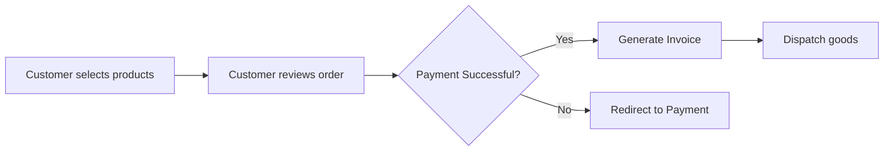
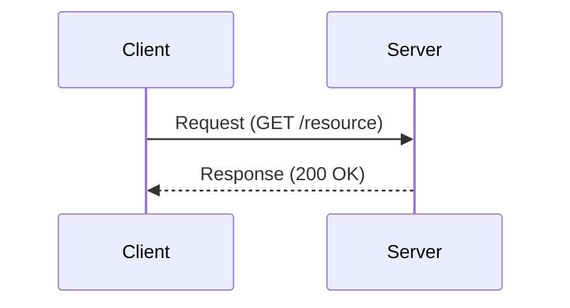
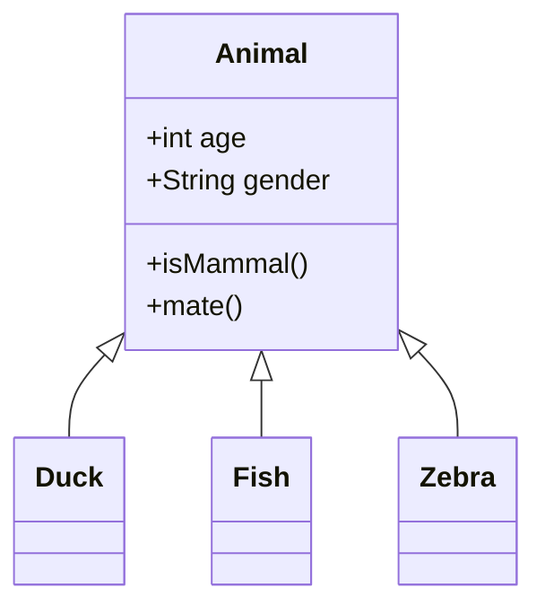
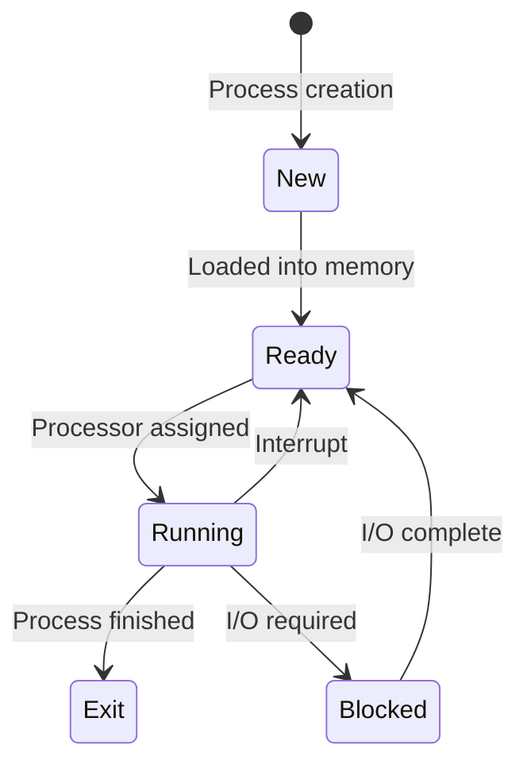
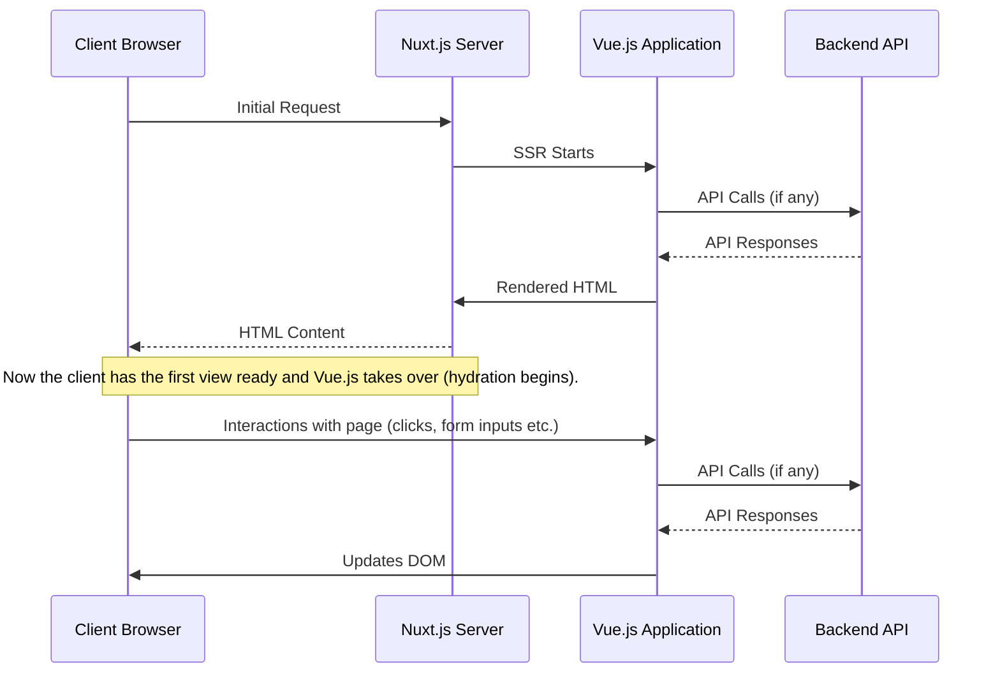

# Introduction

As a seasoned front-end developer, my passion extends beyond coding to sharing knowledge and engaging in enlightening discussions about intriguing tech topics. Often, I find that diagrams are a powerful medium to convey complex ideas - a picture, after all, is worth a thousand words.

However, creating diagrams, whether through tools like draw.io or Excalidraw, isn't always a walk in the park. It can be time-consuming, and a quick brainstorming session could get mired in the details of diagram crafting. This is where Mermaid, a markdown-like script language for generating diagrams, and AI technology come to the rescue.

Leveraging these technologies, I can swiftly translate the ideas sprouting in my mind into clear, precise diagrams. They serve as a catalyst not just for facilitating my understanding of complex topics, but also for sharing these insights with others effectively.

In this blog post, I'll guide you on harnessing the power of ChatGPT and Mermaid to create impactful diagrams and garner deeper understandings of challenging subjects. Whether you aim to boost your personal learning or articulate your ideas more clearly to your peers, these tools can be your secret weapons. Let's delve into this exciting journey of idea visualization!


> "The power of imagination makes us infinite." 
> 
> \- John Muir

# Introduction to Mermaid
Mermaid is an open-source, markdown-like script language for generating charts and diagrams. The beauty of Mermaid lies in its simplicity; you can create intricate diagrams using just text descriptions, making it an excellent choice for documentation, blog posts, and development work.

Mermaid supports a broad range of diagrams, including:

- **Flowcharts**: Ideal for visualizing processes or workflows, such as the process flow in an e-commerce checkout system.




- **Sequence diagrams**: Great for understanding interactions in a system, like the request-response cycle in a client-server model.



- **Class diagrams**: Useful for visualizing the structure of object-oriented systems, like a basic structure of an animal class in a zoological application.




- **State diagrams**: Excellent for describing the behavior of systems, like the various states a software process might have in an operating system.




And many more, including Gantt charts, pie charts, etc.

Now that you have a basic understanding of what Mermaid is capable of, let's discuss how ChatGPT can help generate ideas for these diagrams.

# Why Use ChatGPT and Mermaid?
ChatGPT leverages machine learning to understand and generate human-like text based on the input it receives. It can aid in brainstorming ideas, generating examples, and providing explanations for complex topics. On the other hand, Mermaid is a simple markdown-like script language for generating charts and diagrams. Using Mermaid, you can create flowcharts, sequence diagrams, Gantt charts, and more with just a few lines of code.

When used in conjunction, these two tools can fast-track your diagramming process, helping you develop a multitude of ideas, and create effective, comprehensive diagrams in no time.

## How to Get Started
Here is a practical example of how to use ChatGPT and Mermaid to create diagrams. Imagine you want to understand and illustrate the concept of Server-Side Rendering (SSR) in Nuxt, a popular Vue framework.

Start by asking ChatGPT to explain the concept:

> "Can you explain how Nuxt.js performs server-side rendering?" 

ChatGPT will respond with a detailed explanation. After you have a better understanding of the topic, you can ask ChatGPT to create a Mermaid diagram for it:

> "Can you create a Mermaid diagram to show how Nuxt.js performs server-side rendering?"

ChatGPT will provide you with Mermaid code which you can paste into any tool that supports Mermaid syntax.

This is how the mermaid code will look for example




This is how the diagram will than look:


The beauty of ChatGPT is that it doesn't stop there. If the initial diagram doesn't quite match what you had in mind, you can ask for alternatives:

> "Can you give me different ways to display this in a diagram with Mermaid?"

ChatGPT will then provide different types of diagrams, such as flowcharts, sequence diagrams, or state diagrams, each offering a unique perspective on the same topic.

## Flowchart


## State Diagram


# How to See Your Diagrams

There are multiple ways to visualize your Mermaid diagrams:

- **Mermaid Live Editor**

One of the easiest ways is to use the Mermaid Live Editor available at [https://mermaid.live/](https://mermaid.live/). Just paste the code you got from ChatGPT into the editor, and the diagram will be rendered automatically.

- **Visual Studio Code**

If you are using Visual Studio Code (VS Code), you can install a Mermaid extension like [Markdown Preview Mermaid Support](https://marketplace.visualstudio.com/items?itemName=bierner.markdown-mermaid) itemName=jdinhlife.gruvbox-mermaid). Then, you can create or edit a markdown (`.md`) file and use the following snippet:

```markdown
    ```mermaid
    graph TD;
        A-->B;
        A-->C;
        B-->D;
        C-->D;
    ```
```

- **In html**
You can also embed Mermaid diagrams directly in your HTML files. After including the mermaid.js library, you can place your Mermaid code inside a <div> with the class "mermaid". Here's an example:

```html
<!DOCTYPE html>
<html>
    <head>
        <script src="https://unpkg.com/mermaid/dist/mermaid.min.js"></script>
        <script>mermaid.initialize({startOnLoad:true});</script>
    </head>
    <body>
        <div class="mermaid">
            graph TD
            A-->B
            A-->C
            B-->D
            C-->D
        </div>
    </body>
</html>
```

When you open this HTML file in a browser, your Mermaid diagram will be rendered on the page.

# Conclusion 
The blend of AI and diagramming tools like Mermaid provides us with a powerful method to simplify complex concepts. With just a few lines of text, we can generate diagrams that used to take hours to craft. By revolutionizing the way we learn and share ideas, this innovative approach can truly bring the power of technology to our fingertips.

So, go ahead, give it a try, and experience how AI and Mermaid can revolutionize your diagramming process. If you have any diagrams you're particularly proud of or any tips to share, feel free to drop them in the comments below. Let's learn together!

